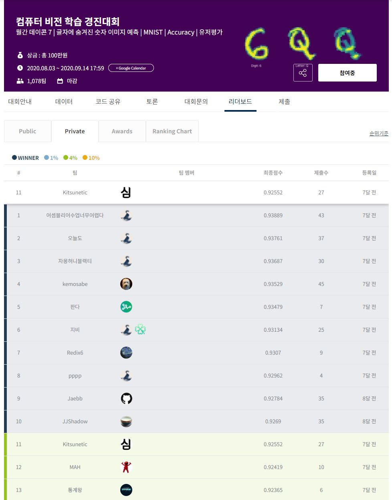
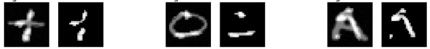

# [데이콘] 컴퓨터 비전 학습 경진대회 11위 솔루션



Private 11위, accuracy 0.92552

## 대회 요약

하나의 입력 이미지에 각각 하나의 알파벳과 숫자가 할당되며, 이미지는 알파벳과 함께 숫자가 알파벳과 겹쳐지는 치는 영역만 출력된 이미지입니다. 즉, 어떤 알파벳과 숫자냐에 따라 거의 빈 이미지일 수도 있고, 숫자의 원형을 그대로 나타나기도 합니다. 어떤 알파벳을 쓰는지는 데이터로 주어집니다.

### 데이터 예시



## 아이디어 요약

EfficientNet-d6을 썼습니다. 알파벳 정보를 활용하여 cross validation, pseudo labeling 등의 기법 없이도 11위의 score를 얻을 수 있었습니다.

1. Image Resize    
EfficientNet은 고해상도의 이미지를 쓸 수록 좋은 성능을 낼 수 있다는 것에 아이디어를 얻어서 단순히 이미지를 확대하는 것 만으로도 상당한 성능의 향상을 볼 수 있었습니다.

2. 숫자 영역과 알파벳 영역을 구분

비록 가려진 숫자영역의 값을 알 수는 없지만, 이미지의 값을 통해 주어진 이미지에서 어느 부분이 알파벳에 의한 영역이고 어떤 부분이 숫자에 의한 영역인지는 알 수 있습니다.
원본 이미지와 숫자 영역만을 강조해서 만든 이미지로 2채널의 영상을 만들어서 학습시켰습니다.

3. 알파벳 정보 학습

모델이 알파벳에 의한 영향을 예측할 수 있다면 더 잘 예측할 수 있지 않을까 하는 생각에 숫자가 이미지에서 숫자가 아니라 어떤 알파벳을 썼는지를 학습시켰습니다.
이후에 알파벳을 학습한 모델의 중간 layer의 feature를 숫자를 학습하는 모델의 중간 layer에 삽입하여 성능을 높일 수 있었습니다.

4. 숫자 정보 학습

3에서 학습된 EfficientNet의 중간 CNN layer의 feature map을 같은 위치의 CNN의 feature에 concatenate 해주었습니다. 이 시점부터 feature의 채널 수가 2배로 늘어나기 때문에 EfficientNet을 직접 수정해서 사용했습니다.

## 실행 방법

### 알파벳 정보 학습

```bash
python train-letter.py B3000 efficientnet-b6 --batch-size 18 --train-valid-ratio 0.01 \
    --image-resize 224 --lr 1e-4 --k-fold 1 \
    --checkpoint-dir "results/checkpoint/letter"
```

### 숫자 정보 학습

```bash
python main.py L3000 efficientnet-b6 --batch-size 18 --train-valid-ratio 0.01 \
    --image-resize 224 --lr 1e-4 --k-fold 1 \
    --checkpoint-dir "results/checkpoint/digit"
    --finetune-model "results/checkpoint/letter/{알파벳 학습에서 얻은 checkpoint}"
```
